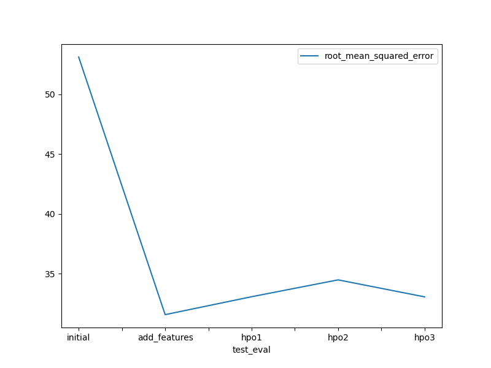
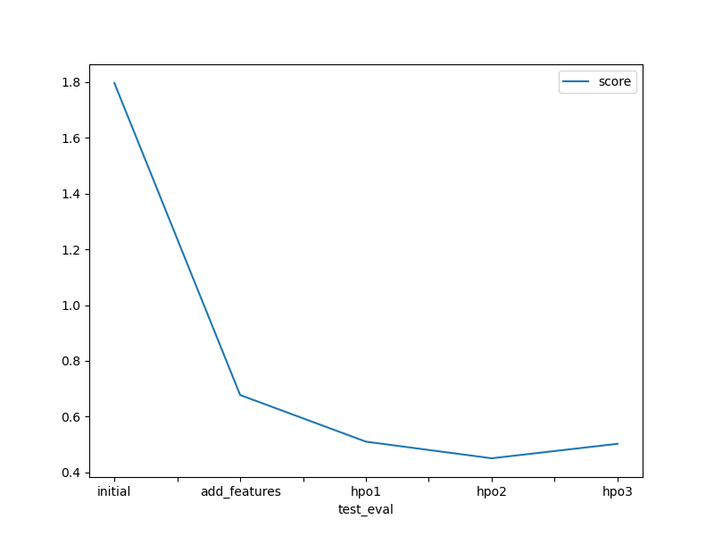

# Report: Predict Bike Sharing Demand with AutoGluon Solution
Yixun Zhou

## Initial Training
### What did you realize when you tried to submit your predictions? What changes were needed to the output of the predictor to submit your results?
Kaggle will reject submissions if we have any negative prediction result. I have to set all negative results to 0. 

### What was the top ranked model that performed?
WeightedEnsemble_L3 was the top ranked model. This makes sense as this model integrated other models' results and weighted for the most possible prediction.

## Exploratory data analysis and feature creation
### What did the exploratory analysis find and how did you add additional features?
Many feature values(such as season,holiday...) are categorical inputs where we need to change their types from int to category so that models can identify them.
Seperated 'hour' from datetime column as 'hour' can be a reasonable variable for predicting 'count'. Here datetime column inputs are of object type and to_datetime function is applied before seperating datetime details.

### How much better did your model preform after adding additional features and why do you think that is?
The root mean squared error dropped drastically compared with initial model, which suggested an improved performance of our model. The reason is the categorical variables are correctly specified after adding additional features, giving model fitting a reasonable higher accuracy.

## Hyper parameter tuning
### How much better did your model preform after trying different hyper parameters?
My model evaluation scores and kaggle scores dropped compared with feature model. Three hyper parameter sets are practiced but the feature model without hyper parameters has the best performance.

### If you were given more time with this dataset, where do you think you would spend more time?
I shall spend more time on learning what hyper parameters mean in different models, and in what way can I finetune the parameters efficiently for testing. This avoid random guessing and practice of tunning, which is likely to leads to trivial performance.

### Create a table with the models you ran, the hyperparameters modified, and the kaggle score.
|model|CAT:iterations|RF:n_estimators|XT_n_estimators|score|
|-----|--------------|---------------|---------------|-----|
|initial|default|default|default|1.79631|
|add_features|default|default|default|0.67743|
|hpo1|10000|300|300|0.51021|
|hpo2|1000|200|200|0.45055|
|hpo3|15000|400|400|0.50246|

### Create a line plot showing the top model score for the three (or more) training runs during the project.

### Create a line plot showing the top kaggle score for the three (or more) prediction submissions during the project.

## Summary
This project is to predict bike sharing demand by AutoGluon from both categorical variables like season and numerical variables like humidity. The add-feature model is proved to be the best model for demand prediction. Performing EDA allows us correctly adding categorical features for valid prediction, and evaluation result saw a drastic drop of prediction error. Hyper parameters in CatBoost, RandomForest and ExtraTreeMSE models were modified for exploring model outputs. I chosed those three models at the top of leaderboard for hyper parameter tuning and model performance were changed accordingly due to iteration and estimator limits. However, the tuning result was trivial. A future direction could be getting more exploration on hyper parameters for AutoGluon models to improve model performance. Another direction is applying Neural Networks which might yield a better performance.